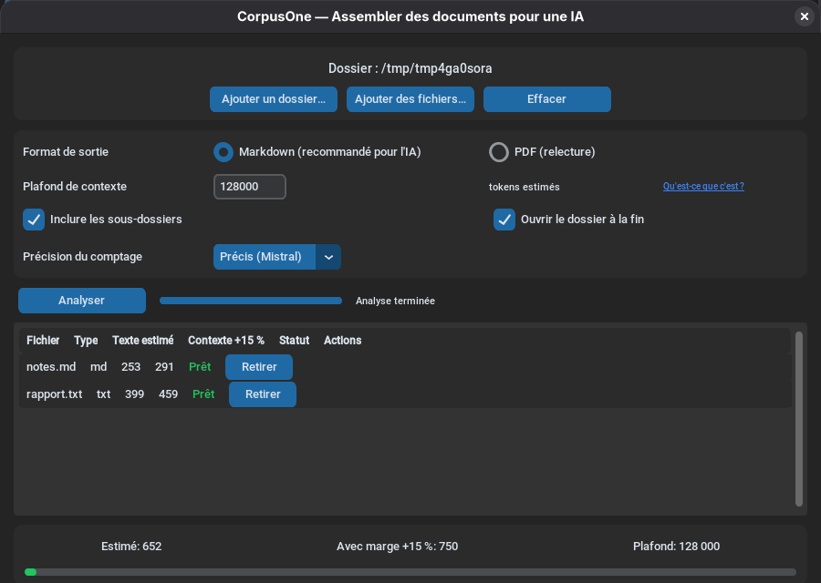

<div align="center">


# DocFuse

**Outil portable Windows d'assemblage de documents vers un corpus unique destiné à un LLM.**
*Portable Windows tool that fuses documents into a single corpus for an LLM.*

[](./LICENSE)
[](./CHANGELOG.md)
[](./pyproject.toml)
[](#-compatibilité--compatibility)
[](./tests)
[](./pyproject.toml)
[](./pyproject.toml)
[](./tests/test_acceptance.py)
[](./tests/test_acceptance.py)
[](./src/docfuse/i18n/)

[🇫🇷 Français](#-français) · [🇬🇧 English](#-english)

</div>

---

> [!IMPORTANT]
> **Sécurité.** DocFuse lit et parse des fichiers dans des formats variés
> (PDF, DOCX, PPTX, etc.). Comme tout parser, ses extracteurs peuvent être
> exposés à des fichiers malformés voire malveillants. Ne lancez pas
> DocFuse sur des sources non fiables sans surveillance. Pour signaler une
> vulnérabilité : voir [SECURITY.md](./SECURITY.md).

---

## 🇫🇷 Français

### Pourquoi DocFuse ?

Donner un dossier entier à un LLM, c'est fastidieux : ouvrir chaque PDF/DOCX,
copier-coller le texte, perdre les tableaux et la structure. **DocFuse**
(anciennement CorpusOne) extrait automatiquement le texte de 13 formats
bureautiques et le concatène en un seul fichier **Markdown** (lisible par tous
les LLMs) ou **PDF** (pour les assistants qui indexent les documents), avec une
estimation du nombre de tokens par fichier et un contrôle de plafond pour ne
pas dépasser la fenêtre de contexte. Si le corpus dépasse ce plafond, l'option
de découpage le répartit en plusieurs fichiers au lieu de bloquer.

### Caractéristiques

- **Portable Windows** : un seul `DocFuse.exe` autoportant, aucune DLL
  externe, aucune installation, aucun droit administrateur. Fonctionne depuis
  une clé USB ou un partage réseau.
- **Hors-ligne strict** : aucune connexion réseau, vérifié par test
  automatisé.
- **Multi-format** : PDF, DOCX, PPTX, XLSX, RTF, HTML, Markdown, CSV/TSV,
  ODT/ODS/ODP, XML/JSON/YAML/INI, EML, MHTML, et une soixantaine
  d'extensions de fichiers de développement (`.py`, `.js`/`.ts`, `.sh`,
  `.sql`, `.css`, `.java`, `.c`/`.cpp`, `.go`, `.rs`, etc.).
- **Compteur de contexte générique** : estimation tokens
  (`octets UTF-8 / 4`) + marge configurable (15 % par défaut).
- **Moteurs de comptage précis en option** : tokens réels de Mistral ou
  d'OpenAI (`--tokenizer-engine {mistral,openai}`), calculé localement,
  sans réseau.
- **Contrôle de plafond** : blocage si un fichier OU le total dépasse le
  plafond (128 000 tokens par défaut).
- **Découpage par budget de tokens** (`--split-context`) : au lieu de bloquer,
  le corpus est réparti en `corpus_001.md`, `corpus_002.md`… chacun sous le
  plafond, sans jamais couper un fichier en deux.
- **Détection d'images et de scans**, avec **OCR optionnel des PDF
  scannés** (Tesseract) : reconnaissance automatique si un moteur est
  disponible, jamais bloquant sinon. `DocFuse.exe` n'embarque pas
  Tesseract (taille inchangée) ; une variante distincte, `DocFuse-OCR.exe`,
  l'embarque pour un usage sans aucune installation.
- **Rapport d'exécution** : liste tous les fichiers (traités, ignorés,
  erreurs), exporté en Markdown et JSON.
- **GUI CustomTkinter + CLI argparse + glisser-déposer** (drag-and-drop).
  La GUI est un extra optionnel : le cœur (CLI + bibliothèque) s'installe sans
  elle.
- **Nom d'application personnalisable** : la variable d'environnement
  `DOCFUSE_APP_NAME` renomme l'exécutable, le dossier de sortie, la config et
  le titre de fenêtre (build interne, marque blanche).
- **i18n complet** : français (défaut) et anglais.
- **Licence Apache 2.0**, dépendances compatibles uniquement
  (MIT/BSD/Apache/ISC/MPL/Python) — pas de GPL/AGPL.

### Capture d'écran

<p align="center">
  
</p>

<p align="center"><sub>Analyse terminée avec le moteur de comptage précis (Mistral) — voir le <a href="docs/guide-utilisateur.md#4-le-compteur-de-contexte">guide utilisateur</a> pour le détail.</sub></p>

### Téléchargement (Windows)

La dernière préversion est **[`v0.1.6 beta`](https://github.com/Martossien/DocFuse/releases/tag/v0.1.6)**
([notes de version](./docs/releases/v0.1.6.md)).

| Fichier | Lien |
|---|---|
| **Archive portable** (`CorpusOne.exe`) | [Télécharger .zip](https://github.com/Martossien/DocFuse/releases/download/v0.1.6/CorpusOne-0.1.6-beta-windows-x64.zip) |
| **Empreinte SHA-256** | [Télécharger .sha256](https://github.com/Martossien/DocFuse/releases/download/v0.1.6/CorpusOne-0.1.6-beta-windows-x64.zip.sha256) |
| **Archive portable avec OCR** (`CorpusOne-OCR.exe`, Tesseract embarqué) | [Télécharger .zip](https://github.com/Martossien/DocFuse/releases/download/v0.1.6/CorpusOne-OCR-0.1.6-beta-windows-x64.zip) |
| **Empreinte SHA-256** (OCR) | [Télécharger .sha256](https://github.com/Martossien/DocFuse/releases/download/v0.1.6/CorpusOne-OCR-0.1.6-beta-windows-x64.zip.sha256) |

> **Renommage.** L'exécutable livré dans les archives `v0.1.6` ci-dessus porte
> encore l'ancien nom de code. À partir de la 0.2.0, les archives s'appellent
> `DocFuse-<version>-beta-windows-x64.zip` et
> `DocFuse-OCR-<version>-beta-windows-x64.zip`, et l'exécutable `DocFuse.exe`.

Installation :

1. Téléchargez l'archive `.zip` (et optionnellement son `.sha256`).
2. Extrayez **le seul** `DocFuse.exe` dans un dossier de votre choix.
3. Double-cliquez sur `DocFuse.exe`. Aucune connexion réseau, aucun
   droit administrateur.

> Le binaire n'est pas signé : Windows SmartScreen affichera un
> avertissement au premier lancement. Vérifiez l'empreinte SHA-256.

### Démarrage rapide

#### Utiliser l'exécutable portable

```bash
# Depuis PowerShell, dans le dossier contenant DocFuse.exe :
.\DocFuse.exe --input "D:\Mon dossier" --output ".\corpus.md" --format md --yes
```

Le corpus et les rapports (`corpus.md`, `corpus_rapport.md`,
`corpus_rapport.json`) sont créés dans `D:\Mon dossier\DocFuse_output\`.

#### Utiliser Python (développement)

Pré-requis : **Python 3.11+**.

```bash
git clone https://github.com/Martossien/DocFuse.git
cd DocFuse
python -m venv .venv
.\.venv\Scripts\Activate.ps1
pip install -e ".[dev,gui]"
```

L'interface graphique est un **extra** : `pip install docfuse` installe le
cœur (CLI + bibliothèque, sans CustomTkinter ni tkinterdnd2),
`pip install "docfuse[gui]"` y ajoute la GUI. Lancée sans l'extra,
`python -m docfuse` affiche un message clair au lieu d'une trace d'erreur.

Lancer la GUI :

```bash
python -m docfuse
```

Lancer la CLI :

```bash
python -m docfuse --input "D:\Mon dossier" --output "corpus.md" --format md --yes
```

### Quel format pour quel outil ?

| Votre outil | Format conseillé | Pourquoi |
|---|---|---|
| Un LLM à grand contexte (chat, API, modèle local) qui reçoit **le fichier entier** | **Markdown** (`corpus.md`) | Tout le corpus tient dans le contexte : le modèle voit chaque `## SOURCE:` et peut citer mot pour mot. Vérifié : 100 % des fichiers retrouvés par un modèle local sur 60 fichiers réels. |
| Un assistant qui **indexe** les documents et répond par recherche (RAG : découpage en passages, puis sélection des passages jugés pertinents) | **PDF** (`corpus.pdf`) | Ces outils découpent un PDF page par page. DocFuse commence chaque fichier source sur une nouvelle page et inscrit sur **chaque page** le nom du fichier et sa position (`rapport.docx (3/12)`) : chaque passage reste attribuable à sa source. Un `.md` est au contraire découpé à taille fixe, à cheval sur les fichiers. |

Limite à connaître : un assistant à recherche ne lit jamais tout le corpus.
Les comptages, « premier/dernier fichier » ou citations de la « ligne
précédente » restent peu fiables quel que soit le format. DocFuse garantit
que rien ne manque dans le fichier produit ; il ne peut pas garantir ce que
l'outil en aval choisit d'en lire.

### Utilisation CLI

```text
docfuse [OPTIONS]

Options :
  -i, --input PATH          Dossier ou fichier à analyser (répétable)
  -o, --output PATH         Fichier de sortie (.md ou .pdf) ou dossier
  -f, --format {md,pdf}     Format de sortie (défaut : md)
  -c, --context INT         Plafond de contexte en tokens (défaut : 128000)
      --margin FLOAT        Marge sur l'estimation tokens (défaut : 0.15)
      --tokenizer-engine    Moteur de comptage : approx (défaut), mistral, openai
      --list-tokenizers     Affiche les moteurs de comptage disponibles
      --recursive           Parcourir les sous-dossiers
      --no-recursive        Ne pas parcourir les sous-dossiers
      --split-context       Découper en plusieurs corpus sous le plafond
                            au lieu de bloquer
      --include-ext EXT     Restreindre aux extensions données (répétable)
      --exclude-glob GLOB   Exclure les fichiers matchant le glob (répétable)
      --report PATH         Chemin du rapport généré
      --dry-run             Générer uniquement les rapports
      --yes                 Ne pas demander confirmation
      --force-images        Inclure les fichiers images dans l'inventaire
      --lang {fr,en}        Langue de l'interface (défaut : fr)
      --config PATH         Fichier de configuration JSON
      --list-formats        Lister les extensions supportées et quitter
      --version             Afficher la version et quitter
  -v, --verbose             Logs détaillés
```

**Codes de retour** :

| Code | Signification |
|------|---------------|
| `0`  | Succès |
| `1`  | Erreur d'utilisation (entrée inexistante, etc.) |
| `2`  | Blocage : fichier OU total > plafond de contexte |
| `3`  | Aucun fichier supporté trouvé |

Le code `2` n'est **jamais** renvoyé en mode découpage (`--split-context`) :
le plafond ne bloque plus, il répartit.

### Découper un corpus trop gros

Par défaut, un fichier — ou le total — au-delà du plafond **bloque** la
génération. L'option `--split-context` (case à cocher « Découper en plusieurs
corpus si le plafond est dépassé (ne bloque jamais) » dans la GUI,
`"split_context": true` dans la config JSON) remplace ce blocage par un
découpage :

- les fichiers sont répartis en `corpus_001.md`, `corpus_002.md`… (ou `.pdf`),
  chacun sous le plafond ;
- le remplissage est **séquentiel**, dans l'ordre du tri : **un fichier n'est
  jamais coupé** en deux ;
- un fichier qui dépasse à lui seul le plafond est **isolé** dans sa propre
  partie et signalé (préambule « Ce fichier dépasse à lui seul le plafond… »
  et rapport) — jamais abandonné en silence ;
- le préambule de chaque partie indique « Partie i/N » et ses totaux ;
- le rapport reste **unique** (`corpus_rapport.md` / `.json`) : il ajoute une
  section « Parties du corpus » (clé JSON `parts`, avec `index`, `files`,
  `tokens_estimated`, `tokens_with_margin`, `oversized`) et donne pour chaque
  fichier la partie qui le contient (clé `part`).

```bash
docfuse -i "D:\Gros dossier" -o "corpus.md" --split-context --yes
```

### Utilisation comme bibliothèque Python

```python
from pathlib import Path

from docfuse.core.orchestrator import generate_corpus, run_analysis
from docfuse.i18n import set_language

# En-têtes de corpus et rapports passent par le catalogue i18n : choisir
# la langue avant l'analyse.
set_language("fr")

# Lancer l'analyse (un chemin, une liste de chemins ou une InputSelection)
result = run_analysis(
    input_path=Path("D:/Mon dossier"),
    context_limit=128_000,
    margin=0.15,
)

# Inspecter le résultat
for f in result.files:
    print(f"{f.relative_path}: {f.status.value}, "
          f"{f.text_length} caractères, {f.image_count} images")

# Générer le corpus si non bloqué. Plafond et marge sont ceux du résultat :
# generate_corpus ne les reprend plus en paramètres.
if not result.is_blocked:
    generate_corpus(result, Path("corpus.md"))
```

Pour ne jamais bloquer, le mode découpage écrit plusieurs corpus sous le
plafond :

```python
from pathlib import Path

from docfuse.core.orchestrator import generate_corpus_parts, run_analysis
from docfuse.core.splitter import split_by_budget
from docfuse.i18n import set_language

set_language("fr")

result = run_analysis(input_path=Path("D:/Mon dossier"), split_context=True)

# Simuler la répartition sans rien écrire (module pur, sans effet de bord)
for part in split_by_budget(result):
    print(f"partie {part.index} : {len(part.file_indices)} fichiers, "
          f"{part.tokens_with_margin} tokens, hors plafond : {part.oversized}")

# Écrire corpus_001.md, corpus_002.md… + le rapport unique
for path in generate_corpus_parts(result, Path("corpus.md")):
    print(path.name)
```

`generate_corpus` délègue lui-même à `generate_corpus_parts` quand
`result.split_context` est vrai : les deux appels sont interchangeables.

### Configuration

DocFuse charge sa configuration depuis trois emplacements (du moins prioritaire
au plus prioritaire) :

1. Valeurs par défaut (cf. `src/docfuse/constants.py`).
2. `DocFuse.json` à côté de l'exécutable (ou `pyproject.toml` du projet).
3. `config.json` dans `%APPDATA%\DocFuse\` (ou `~/.config/DocFuse/`
   sous Linux).
4. `--config PATH` en CLI.

Exemple `DocFuse.json` :

```json
{
  "context_limit": 128000,
  "margin": 0.15,
  "format": "md",
  "split_context": false,
  "recursive": true,
  "max_depth": 8,
  "exclude_globs": ["~$*", "Thumbs.db"],
  "sort": "name",
  "lang": "fr"
}
```

Ces noms dérivent du nom d'application (`DOCFUSE_APP_NAME`). Une configuration
laissée par une 0.1.x sous l'ancien nom est encore **lue** en repli, à chaque
niveau, tant qu'aucun fichier au nouveau nom n'existe au même endroit — mais
jamais réécrite.

### Architecture

```
src/docfuse/
├── __main__.py             # sans args → GUI, avec args → CLI
├── cli.py                  # CLI argparse + i18n + codes retour 0-3
├── gui/                    # GUI CustomTkinter : app.py (fenêtre), helpers.py (fonctions pures), dnd.py
├── config.py               # config JSON (3 niveaux) + validate()
├── branding.py             # nom d'application (DOCFUSE_APP_NAME) + noms dérivés
├── i18n.py                 # catalogue FR/EN + format_number()
├── constants.py            # extensions, seuils, couleurs, IMAGE_EXTENSIONS
├── assets/                 # DejaVuSans.ttf (police PDF Unicode), tekken_240911.json (vocab Mistral), o200k_base.tiktoken (vocab OpenAI)
├── core/
│   ├── orchestrator.py     # pipeline multi-sources + scan_config + sort + max_depth
│   ├── splitter.py         # découpage par budget de tokens (split_by_budget)
│   ├── registry.py         # @register + dispatch par extension
│   ├── context_counter.py  # estimateur tokens (octets/4, +15%) + moteur en option
│   ├── tokenizers/         # registre de moteurs de comptage : approx (défaut), mistral
│   ├── image_detector.py   # détection images + seuils pauvreté
│   ├── inventory.py        # parcours dossier, liste blanche, tri name/mtime/type
│   ├── progress.py         # ProgressEvent (thread-safe)
│   └── report.py           # rapport MD + JSON (i18n)
├── extractors/             # un extracteur = un fichier, registration par @register
│   ├── base.py             # Extractor ABC + safe_extract défensif
│   ├── pdf.py              # pdfminer.six + pypdf
│   ├── docx.py, pptx.py, xlsx.py
│   ├── rtf.py, html.py, text.py
│   ├── markdown.py, csv_tsv.py
│   ├── odf.py, xml_json.py, eml.py, mhtml.py
├── output/
│   ├── markdown_writer.py  # corpus .md + CRLF support
│   ├── pdf_writer.py       # ReportLab + DejaVu Sans
│   └── source_header.py    # en-tête SOURCE + backticks adaptatifs
└── models/
    ├── extraction_result.py # ExtractedFile (dataclass)
    ├── input_selection.py   # sélection exacte, dédoublonnage
    └── file_status.py       # enum FileStatus
```

### Développement

```bash
# Tests
pytest tests/ -v

# Tests d'acceptation (CdC §19)
pytest tests/test_acceptance.py -v

# Lint + format
ruff check src/ tests/
ruff format --check src/ tests/

# Type check strict
mypy --strict src/docfuse/

# Vérification licences (doit ne remonter aucune GPL/AGPL runtime)
pip-licenses --from=classifier --allow-only="MIT;BSD;Apache Software License;ISC License;Mozilla Public License 2.0;Python Software Foundation License;SIL Open Font License"
```

### Build Windows portable

```bash
# Sur une machine Windows avec Python 3.11+ et PyInstaller
pip install pyinstaller
pyinstaller --noconfirm DocFuse.spec

# Le binaire est dans dist/DocFuse.exe (~40 Mo, autoportant)

# Variante avec OCR bundlé (Tesseract) — nécessite Tesseract installé
# localement au moment du build (voir DocFuse-OCR.spec pour le détail) :
choco install tesseract -y
pyinstaller --noconfirm DocFuse-OCR.spec

# Distribuer sous un autre nom : la spec lit DOCFUSE_APP_NAME au build
DOCFUSE_APP_NAME=MonOutil pyinstaller --noconfirm DocFuse.spec
# → dist/MonOutil.exe, dossier de sortie MonOutil_output/, config MonOutil.json
```

### Contribution

Les contributions sont les bienvenues. Voir
[CONTRIBUTING.md](./CONTRIBUTING.md) pour le workflow complet
(pré-requis, conventions, ajout d'un extracteur, journaux de session).
Le code de conduite est dans [CODE_OF_CONDUCT.md](./CODE_OF_CONDUCT.md).

### Documentation complémentaire

- [Guide utilisateur](./docs/guide-utilisateur.md) — tutoriel GUI + exemples CLI
- [Cahier des charges](./docs/cahier-des-charges-docfuse.md) — spécification
  contractuelle (lecture seule)
- [Journal des décisions](./docs/journal-decisions.md) — 103 décisions
  d'architecture (D-001 à D-103)
- [Journal d'avancement](./docs/journal-avancement.md) — historique des sessions
- [Notes de version](./docs/releases/) — une page par release tag

### Licence

[Apache License 2.0](./LICENSE). Voir aussi [NOTICE](./NOTICE) pour les
attributions des dépendances.

---

## 🇬🇧 English

### Why DocFuse?

Hand-feeding an LLM a whole folder is tedious: open each PDF/DOCX, copy-paste
the text, lose the tables and structure. **DocFuse** (formerly CorpusOne)
automatically extracts the text from 13 office formats and concatenates it into
a single **Markdown** file (readable by any LLM) or **PDF** (for assistants that
index documents), with a per-file and total token estimate and a hard ceiling so
you never overflow the model's context window. When the corpus exceeds that
ceiling, the split option spreads it over several files instead of blocking.

### Features

- **Portable Windows**: a single self-contained `DocFuse.exe`, no external
  DLL, no install, no admin rights. Runs from a USB stick or a network share.
- **Strictly offline**: no network access, enforced by an automated test.
- **Multi-format**: PDF, DOCX, PPTX, XLSX, RTF, HTML, Markdown, CSV/TSV,
  ODT/ODS/ODP, XML/JSON/YAML/INI, EML, MHTML, plus about sixty development
  file extensions (`.py`, `.js`/`.ts`, `.sh`, `.sql`, `.css`, `.java`,
  `.c`/`.cpp`, `.go`, `.rs`, etc.).
- **Generic context counter**: tokens estimate (`UTF-8 bytes / 4`) +
  configurable margin (15% by default).
- **Optional precise counting engines**: real token count for Mistral or
  OpenAI (`--tokenizer-engine {mistral,openai}`), computed locally, no
  network.
- **Ceiling control**: blocks if a single file OR the total exceeds the
  ceiling (128,000 tokens by default).
- **Token-budget splitting** (`--split-context`): instead of blocking, the
  corpus is spread over `corpus_001.md`, `corpus_002.md`… each under the
  ceiling, never cutting a file in two.
- **Image and scan detection**, with **optional OCR for scanned PDFs**
  (Tesseract): recognized automatically if an engine is available, never
  blocking otherwise. `DocFuse.exe` does not bundle Tesseract (unchanged
  size); a separate variant, `DocFuse-OCR.exe`, bundles it for a
  zero-install experience.
- **Run report**: lists every file (processed, ignored, errors), exported as
  Markdown and JSON.
- **CustomTkinter GUI + argparse CLI + drag-and-drop**. The GUI is an optional
  extra: the core (CLI + library) installs without it.
- **Customisable application name**: the `DOCFUSE_APP_NAME` environment
  variable renames the executable, the output folder, the config files and the
  window title (internal build, white label).
- **Full i18n**: French (default) and English.
- **Apache 2.0** license, only compatible dependencies
  (MIT/BSD/Apache/ISC/MPL/Python) — no GPL/AGPL.

### Screenshot

<p align="center">
  
</p>

<p align="center"><sub>Analysis done with the precise counting engine (Mistral) — see the <a href="docs/guide-utilisateur.md#4-le-compteur-de-contexte">user guide</a> (French) for details.</sub></p>

### Download (Windows)

The latest pre-release is **[`v0.1.6 beta`](https://github.com/Martossien/DocFuse/releases/tag/v0.1.6)**
([release notes](./docs/releases/v0.1.6.md), French).

| File | Link |
|---|---|
| **Portable archive** (`CorpusOne.exe`) | [Download .zip](https://github.com/Martossien/DocFuse/releases/download/v0.1.6/CorpusOne-0.1.6-beta-windows-x64.zip) |
| **SHA-256 checksum** | [Download .sha256](https://github.com/Martossien/DocFuse/releases/download/v0.1.6/CorpusOne-0.1.6-beta-windows-x64.zip.sha256) |
| **Portable archive with OCR** (`CorpusOne-OCR.exe`, Tesseract bundled) | [Download .zip](https://github.com/Martossien/DocFuse/releases/download/v0.1.6/CorpusOne-OCR-0.1.6-beta-windows-x64.zip) |
| **SHA-256 checksum** (OCR) | [Download .sha256](https://github.com/Martossien/DocFuse/releases/download/v0.1.6/CorpusOne-OCR-0.1.6-beta-windows-x64.zip.sha256) |

> **Renaming.** The executable shipped in the `v0.1.6` archives above still
> carries the old code name. From 0.2.0 on, the archives are named
> `DocFuse-<version>-beta-windows-x64.zip` and
> `DocFuse-OCR-<version>-beta-windows-x64.zip`, and the executable `DocFuse.exe`.

Install:

1. Download the `.zip` (and optionally its `.sha256`).
2. Extract **the single** `DocFuse.exe` to a folder of your choice.
3. Double-click `DocFuse.exe`. No network access, no admin rights.

> The binary is unsigned: Windows SmartScreen will show a warning on first
> launch. Verify the SHA-256.

### Quick start

#### Using the portable executable

```bash
# From PowerShell, in the folder containing DocFuse.exe:
.\DocFuse.exe --input "D:\My folder" --output ".\corpus.md" --format md --yes
```

The corpus and reports (`corpus.md`, `corpus_rapport.md`,
`corpus_rapport.json`) are written to `D:\My folder\DocFuse_output\`.

#### Using Python (development)

Requirements: **Python 3.11+**.

```bash
git clone https://github.com/Martossien/DocFuse.git
cd DocFuse
python -m venv .venv
source .venv/bin/activate          # Linux / macOS
# .venv\Scripts\Activate.ps1       # Windows PowerShell
pip install -e ".[dev,gui]"
```

The graphical interface is an **extra**: `pip install docfuse` installs the
core (CLI + library, without CustomTkinter or tkinterdnd2),
`pip install "docfuse[gui]"` adds the GUI. Without the extra,
`python -m docfuse` prints a clear message instead of a traceback.

Launch the GUI:

```bash
python -m docfuse
```

Launch the CLI:

```bash
python -m docfuse --input "D:/My folder" --output "corpus.md" --format md --yes
```

### Which format for which tool?

| Your tool | Recommended format | Why |
|---|---|---|
| A long-context LLM (chat, API, local model) that receives **the whole file** | **Markdown** (`corpus.md`) | The entire corpus fits in the context window: the model sees every `## SOURCE:` and can quote verbatim. Verified: 100% of files found by a local model on 60 real files. |
| An assistant that **indexes** documents and answers by retrieval (RAG: split into passages, then pick the passages it deems relevant) | **PDF** (`corpus.pdf`) | Such tools split a PDF page by page. DocFuse starts every source file on a new page and prints the file name and its position (`report.docx (3/12)`) on **every page**: each passage stays attributable to its source. A `.md` is split at a fixed size instead, straddling files. |

Known limit: a retrieval-based assistant never reads the whole corpus.
Counts, "first/last file" or "the line before" quotes remain unreliable
whatever the format. DocFuse guarantees nothing is missing from the file it
produces; it cannot guarantee what the downstream tool chooses to read.

### CLI usage

```text
docfuse [OPTIONS]

Options:
  -i, --input PATH          Folder or file to analyse (repeatable)
  -o, --output PATH         Output file (.md or .pdf) or folder
  -f, --format {md,pdf}     Output format (default: md)
  -c, --context INT         Context ceiling in tokens (default: 128000)
      --margin FLOAT        Margin on token estimate (default: 0.15)
      --tokenizer-engine    Counting engine: approx (default), mistral, openai
      --list-tokenizers     List available counting engines
      --recursive           Walk sub-folders
      --no-recursive        Do not walk sub-folders
      --split-context       Split into several corpora under the ceiling
                            instead of blocking
      --include-ext EXT     Restrict to given extensions (repeatable)
      --exclude-glob GLOB   Exclude files matching the glob (repeatable)
      --report PATH         Path of the generated report
      --dry-run             Only generate the reports
      --yes                 Skip confirmation prompt
      --force-images        Include image files in the inventory
      --lang {fr,en}        UI language (default: fr)
      --config PATH         JSON configuration file
      --list-formats        List supported extensions and exit
      --version             Print version and exit
  -v, --verbose             Verbose logs
```

**Exit codes**:

| Code | Meaning |
|------|---------|
| `0`  | Success |
| `1`  | Usage error (input not found, etc.) |
| `2`  | Blocked: file OR total > context ceiling |
| `3`  | No supported file found |

Exit code `2` is **never** returned in split mode (`--split-context`): the
ceiling no longer blocks, it splits.

### Splitting an oversized corpus

By default, a file — or the total — above the ceiling **blocks** generation.
The `--split-context` option (checkbox "Split into several corpora when the
limit is exceeded (never blocks)" in the GUI, `"split_context": true` in the
JSON config) replaces that block with a split:

- files are spread over `corpus_001.md`, `corpus_002.md`… (or `.pdf`), each
  under the ceiling;
- filling is **sequential**, in sort order: **a file is never cut** in two;
- a file that exceeds the ceiling on its own is **isolated** in its own part
  and flagged (preamble and report) — never silently dropped;
- each part's preamble states "Part i/N" and its own totals;
- the report stays **single** (`corpus_rapport.md` / `.json`): it adds a
  "Corpus parts" section (JSON key `parts`, with `index`, `files`,
  `tokens_estimated`, `tokens_with_margin`, `oversized`) and gives each file
  the part that holds it (key `part`).

```bash
docfuse -i "D:\Big folder" -o "corpus.md" --split-context --yes
```

### Use as a Python library

```python
from pathlib import Path

from docfuse.core.orchestrator import generate_corpus, run_analysis
from docfuse.i18n import set_language

# Corpus headers and reports go through the i18n catalog: pick the
# language before running the analysis.
set_language("en")

# Run the analysis (a path, a list of paths or an InputSelection)
result = run_analysis(
    input_path=Path("D:/My folder"),
    context_limit=128_000,
    margin=0.15,
)

# Inspect the result
for f in result.files:
    print(f"{f.relative_path}: {f.status.value}, "
          f"{f.text_length} chars, {f.image_count} images")

# Generate the corpus if not blocked. Ceiling and margin come from the
# result: generate_corpus no longer takes them as parameters.
if not result.is_blocked:
    generate_corpus(result, Path("corpus.md"))
```

To never block, split mode writes several corpora under the ceiling:

```python
from pathlib import Path

from docfuse.core.orchestrator import generate_corpus_parts, run_analysis
from docfuse.core.splitter import split_by_budget
from docfuse.i18n import set_language

set_language("en")

result = run_analysis(input_path=Path("D:/My folder"), split_context=True)

# Preview the split without writing anything (pure, side-effect-free module)
for part in split_by_budget(result):
    print(f"part {part.index}: {len(part.file_indices)} files, "
          f"{part.tokens_with_margin} tokens, oversized: {part.oversized}")

# Write corpus_001.md, corpus_002.md… + the single report
for path in generate_corpus_parts(result, Path("corpus.md")):
    print(path.name)
```

`generate_corpus` delegates to `generate_corpus_parts` on its own when
`result.split_context` is true: the two calls are interchangeable.

### Configuration

DocFuse loads its configuration from four sources (lowest to highest priority):

1. Built-in defaults (see `src/docfuse/constants.py`).
2. `DocFuse.json` next to the executable (or `pyproject.toml`).
3. `config.json` in `%APPDATA%\DocFuse\` (or `~/.config/DocFuse/`
   on Linux).
4. `--config PATH` on the CLI.

Example `DocFuse.json`:

```json
{
  "context_limit": 128000,
  "margin": 0.15,
  "format": "md",
  "split_context": false,
  "recursive": true,
  "max_depth": 8,
  "exclude_globs": ["~$*", "Thumbs.db"],
  "sort": "name",
  "lang": "fr"
}
```

These names derive from the application name (`DOCFUSE_APP_NAME`). A config
left behind by a 0.1.x under the old name is still **read** as a fallback at
each level, as long as no file under the new name exists at the same place —
but never written back.

### Architecture

```
src/docfuse/
├── __main__.py             # no args → GUI, args → CLI
├── cli.py                  # CLI argparse + i18n + exit codes 0-3
├── gui/                    # CustomTkinter GUI: app.py (window), helpers.py (pure functions), dnd.py
├── config.py               # JSON config (3 layers) + validate()
├── branding.py             # application name (DOCFUSE_APP_NAME) + derived names
├── i18n.py                 # FR/EN catalog + format_number()
├── constants.py            # extensions, thresholds, colours, IMAGE_EXTENSIONS
├── assets/                 # DejaVuSans.ttf (Unicode PDF font), tekken_240911.json (Mistral vocab), o200k_base.tiktoken (OpenAI vocab)
├── core/
│   ├── orchestrator.py     # multi-source pipeline + scan_config + sort + max_depth
│   ├── splitter.py         # token-budget splitting (split_by_budget)
│   ├── registry.py         # @register + dispatch by extension
│   ├── context_counter.py  # tokens estimator (bytes/4, +15%) + optional engine
│   ├── tokenizers/         # counting engine registry: approx (default), mistral
│   ├── image_detector.py   # image detection + low-text thresholds
│   ├── inventory.py        # folder walk, whitelist, name/mtime/type sort
│   ├── progress.py         # ProgressEvent (thread-safe)
│   └── report.py           # MD + JSON report (i18n)
├── extractors/             # one extractor = one file, auto @register
│   ├── base.py             # Extractor ABC + defensive safe_extract
│   ├── pdf.py              # pdfminer.six + pypdf
│   ├── docx.py, pptx.py, xlsx.py
│   ├── rtf.py, html.py, text.py
│   ├── markdown.py, csv_tsv.py
│   ├── odf.py, xml_json.py, eml.py, mhtml.py
├── output/
│   ├── markdown_writer.py  # .md corpus + CRLF support
│   ├── pdf_writer.py       # ReportLab + DejaVu Sans
│   └── source_header.py    # SOURCE header + adaptive backticks
└── models/
    ├── extraction_result.py # ExtractedFile (dataclass)
    ├── input_selection.py   # exact selection, deduplication
    └── file_status.py       # FileStatus enum
```

### Development

```bash
# Tests
pytest tests/ -v

# Acceptance tests (spec §19)
pytest tests/test_acceptance.py -v

# Lint + format
ruff check src/ tests/
ruff format --check src/ tests/

# Strict type check
mypy --strict src/docfuse/

# License check (must not report any runtime GPL/AGPL)
pip-licenses --from=classifier --allow-only="MIT;BSD;Apache Software License;ISC License;Mozilla Public License 2.0;Python Software Foundation License;SIL Open Font License"
```

### Build the Windows portable

```bash
# On a Windows machine with Python 3.11+ and PyInstaller
pip install pyinstaller
pyinstaller --noconfirm DocFuse.spec

# The binary lands in dist/DocFuse.exe (~40 MB, self-contained)

# OCR-bundled variant (Tesseract) — requires Tesseract installed locally
# at build time (see DocFuse-OCR.spec for details):
choco install tesseract -y
pyinstaller --noconfirm DocFuse-OCR.spec

# Ship under another name: the spec reads DOCFUSE_APP_NAME at build time
DOCFUSE_APP_NAME=MyTool pyinstaller --noconfirm DocFuse.spec
# → dist/MyTool.exe, output folder MyTool_output/, config MyTool.json
```

### Contributing

Contributions are welcome. See
[CONTRIBUTING.md](./CONTRIBUTING.md) for the full workflow
(prerequisites, conventions, adding an extractor, session logs).
Code of conduct in [CODE_OF_CONDUCT.md](./CODE_OF_CONDUCT.md).

### Further documentation

- [User guide](./docs/guide-utilisateur.md) — GUI tutorial + CLI examples
  *(currently French-only)*
- [Specification](./docs/cahier-des-charges-docfuse.md) — contractual
  specification (read-only, French)
- [Decision log](./docs/journal-decisions.md) — 103 architecture decisions
  (D-001 to D-103, French)
- [Progress log](./docs/journal-avancement.md) — session-by-session history
  (French)
- [Release notes](./docs/releases/) — one page per release tag

### License

[Apache License 2.0](./LICENSE). See [NOTICE](./NOTICE) for dependency
attributions.

---

<div align="center">

Made with care for the open-source community.

**[⬆ Back to top](#docfuse)**

</div>
