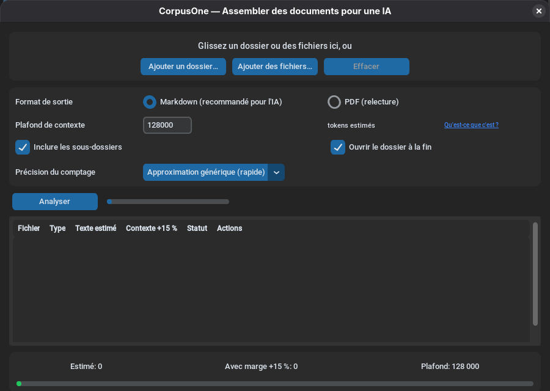
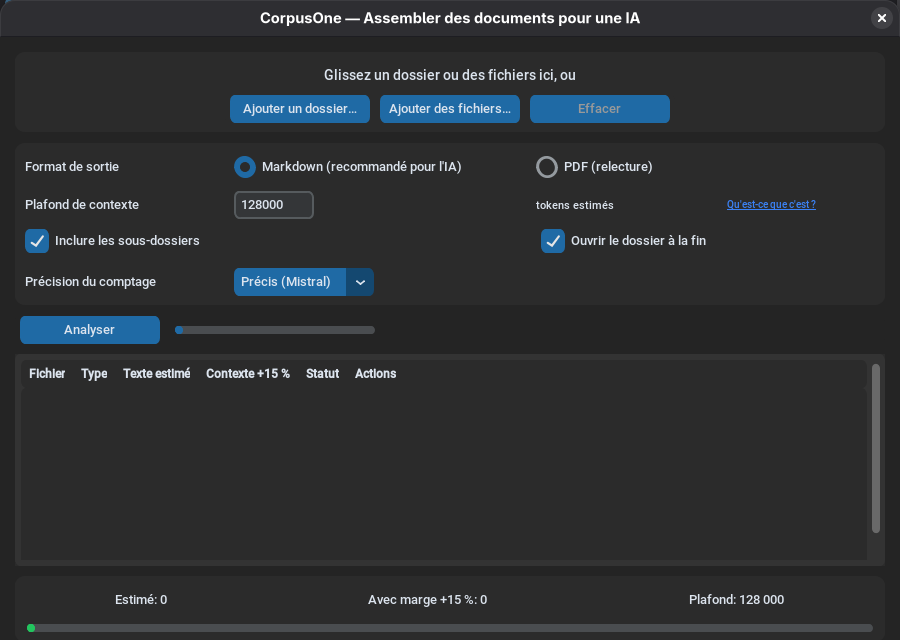

# Guide utilisateur DocFuse

> Mini guide français — usage GUI et exemples CLI (CdC §21.5)
> Version 0.2.0 beta — 30 août 2026

---

## Qu'est-ce que DocFuse ?

DocFuse (anciennement CorpusOne) est un outil qui assemble les documents d'un ou plusieurs
dossiers, ou une sélection précise de fichiers (PDF, Word, PowerPoint, Excel, HTML,
texte, etc.), en **un seul fichier** prêt à être donné à une IA (LLM). Il extrait le
texte, estime le nombre de tokens de chaque fichier et du corpus complet, puis vous
avertit si le plafond de contexte est dépassé — ou, si vous cochez l'option de
découpage, répartit le tout en plusieurs corpus qui tiennent chacun sous le plafond.

**Pas d'installation, pas de droits admin, pas d'internet.** Ça marche depuis une clé USB.

---

## Utilisation avec l'interface graphique

### 1. Lancer DocFuse

Double-cliquez sur `DocFuse.exe`. La fenêtre s'ouvre (pas de console noire).

### 2. Choisir les documents

- Cliquez sur **« Ajouter un dossier… »** pour analyser son contenu et, si l'option est
  cochée, ses sous-dossiers.
- Cliquez sur **« Ajouter des fichiers… »** pour sélectionner uniquement certains
  fichiers. Chaque nouvelle sélection s'ajoute aux précédentes ; les autres fichiers
  présents dans leur dossier ne sont pas ajoutés.
- Vous pouvez aussi glisser-déposer un dossier ou plusieurs fichiers sur la zone du haut.
- L'analyse démarre automatiquement.

Lorsqu'un dossier contient de nombreux documents, ils apparaissent d'abord avec le statut
**En attente**, puis leurs estimations sont affichées au fur et à mesure de l'extraction.

### 3. Comprendre la liste

Chaque fichier apparaît avec son statut :

| Couleur | Statut | Signification |
|---|---|---|
| 🟢 Vert | Prêt | Texte extractible, sous le plafond |
| 🟡 Jaune | Images | Contient des images — le texte sera pris, le visuel ne sera pas lu |
| 🟠 Orange | Peu de texte | Probablement un scan — l'IA n'aura presque rien de ce fichier |
| 🔴 Rouge | Trop volumineux | Fichier seul ≥ plafond → génération bloquée (sauf en mode découpage, §6) |
| ⚪ Gris | Ignoré | Extension non supportée (ex: .exe, .jpg) |
| 🔴 Rouge | Erreur | Corrompu, protégé par mot de passe |

Les colonnes **Texte estimé** et **Contexte +15 %** donnent le nombre approximatif de
tokens pour chaque fichier. Le bouton **Retirer** enlève immédiatement un document du
corpus et recalcule le total sans relancer l'extraction. Le retrait reste appliqué si
vous cliquez ensuite sur **Analyser**.

### 4. Le compteur de contexte

En bas, un bandeau affiche :
- **Estimé** : volume de tokens estimé (octets UTF-8 / 4)
- **Avec marge +15 %** : estimation + marge de sécurité
- **Plafond** : limite de contexte (128 000 par défaut, modifiable)
- **Jauge** : verte (< 80 %), orange (80-99 %), rouge (≥ 100 %)

Si la jauge est rouge, le bouton **Générer** est désactivé.
**Solution** : montez le plafond, cliquez sur **Retirer** pour les documents inutiles
ou les plus volumineux, ou cochez **« Découper en plusieurs corpus »** (voir §6) —
dans ce dernier cas le bouton **Générer** reste actif quel que soit le total.

**Précision du comptage** : par défaut, DocFuse utilise l'approximation générique
ci-dessus. Le menu déroulant « Précision du comptage » permet de choisir un moteur
précis — **Mistral** (Tekken) ou **OpenAI** (`o200k_base`, GPT-4o/4.1) — qui
compte les tokens réels de ce modèle, calculé localement sans connexion réseau.
Utile si vous visez précisément l'un de ces modèles ; pour les autres IA,
l'approximation reste un bon indicateur générique. Changer le menu recalcule
**instantanément** le tableau et les totaux, sans relancer l'analyse.

> **Note sur les captures d'écran.** Les captures de ce guide ont été prises avant
> la 0.2.0 : la fenêtre y porte encore l'ancien nom de code et n'affiche pas la case
> à cocher « Découper en plusieurs corpus ». Les menus et les colonnes, eux, sont
> inchangés.

<p align="center">
  
  
  
</p>

### 5. Générer le corpus

- Choisissez **Markdown** (recommandé pour l'IA) ou **PDF** (relecture humaine).
- Modifiez le plafond si besoin (recalcul instantané sans ré-extraction).
- Cliquez sur **Générer**.
- Le fichier `corpus.md` (ou `corpus.pdf`) est créé dans `DocFuse_output/`.
- Le rapport d'exécution est généré à côté (`corpus_rapport.md` + `.json`).

### 6. Découper en plusieurs corpus (nouveau en 0.2.0)

La case à cocher **« Découper en plusieurs corpus si le plafond est dépassé
(ne bloque jamais) »** change ce qui se passe quand le total — ou un seul fichier —
dépasse le plafond : au lieu de refuser de générer, DocFuse répartit les documents
en plusieurs corpus successifs.

**Ce que vous obtenez** dans `DocFuse_output/` :

| Fichier | Contenu |
|---|---|
| `corpus_001.md` | Première partie : les premiers documents, jusqu'au plafond |
| `corpus_002.md` | Deuxième partie : la suite, jusqu'au plafond |
| `corpus_003.md`… | Et ainsi de suite, autant de parties que nécessaire |
| `corpus_rapport.md` / `.json` | **Un seul** rapport, commun à toutes les parties |

Il n'y a plus de fichier `corpus.md` unique : ce nom sert seulement de base pour
numéroter les parties. En PDF, le principe est identique (`corpus_001.pdf`, …).

**Les règles à connaître :**

- **Un document n'est jamais coupé en deux.** Un fichier appartient entièrement à
  une partie et à une seule : vous pouvez donner une partie à une IA sans qu'un
  document y soit tronqué.
- **L'ordre est préservé.** Le remplissage est séquentiel dans l'ordre de tri
  affiché à l'écran : la partie 1 contient les premiers fichiers de la liste.
- **Un fichier trop gros à lui seul** (plus volumineux que le plafond) n'est pas
  abandonné : il est **isolé dans sa propre partie**, avec la mention « Ce fichier
  dépasse à lui seul le plafond… » en tête de cette partie et une ligne dédiée dans
  le rapport. À vous de décider quoi en faire (le retirer, monter le plafond).
- **Chaque partie s'annonce.** Son préambule indique « Partie 2/5 » ainsi que les
  tokens estimés et les tokens avec marge de cette partie.

**Ce que dit le rapport :** une section **« Parties du corpus »** liste chaque partie
avec son nom de fichier, son nombre de documents, ses tokens et l'indication
« Hors plafond (isolé) » le cas échéant. Le tableau des fichiers gagne une colonne
**Partie** qui vous dit, pour chaque document, dans quel corpus le retrouver.
En JSON, ce sont la clé `parts` (avec `index`, `files`, `tokens_estimated`,
`tokens_with_margin`, `oversized`) et, sur chaque fichier, la clé `part`.

**Quand l'utiliser ?** Quand vous devez donner un gros dossier à une IA et que vous
êtes prêt à faire plusieurs envois successifs. Quand vous voulez au contraire un
seul fichier, laissez la case décochée : le blocage vous prévient que le corpus ne
tiendra pas.

---

## Utilisation en ligne de commande

### Syntaxe

```
DocFuse.exe --input <chemin> [options]
```

### Exemples

**Assembler un dossier en Markdown :**
```
DocFuse.exe -i "D:\Projets\Rapports" -o "D:\Sortie\corpus.md"
```

**Assembler en PDF :**
```
DocFuse.exe -i "D:\Projets" -o "corpus.pdf" --format pdf
```

**Analyse seule (sans générer), avec rapport :**
```
DocFuse.exe -i "D:\Projets" --dry-run --report "D:\rapport.json"
```

**Changer le plafond de contexte :**
```
DocFuse.exe -i "D:\Projets" --context 200000
```

**Compter les tokens réels d'un modèle Mistral :**
```
DocFuse.exe -i "D:\Projets" --tokenizer-engine mistral
```

**Lister les moteurs de comptage disponibles :**
```
DocFuse.exe --list-tokenizers
```

**Assembler uniquement plusieurs fichiers précis :**
```
DocFuse.exe -i "D:\Contrats\contrat.pdf" -i "D:\Notes\synthese.docx" -o "D:\Sortie\corpus.md"
```

Chaque option `--input` est prise en compte. Une liste de fichiers n'est jamais élargie
automatiquement à tout leur dossier parent.

**Non-interactif (scripts) — échoue si blocage :**
```
DocFuse.exe -i "D:\Projets" --yes -o "corpus.md"
```

**Ne prendre que les .txt et .md :**
```
DocFuse.exe -i "D:\Projets" --include-ext ".txt" --include-ext ".md"
```

**Découper en plusieurs corpus au lieu de bloquer :**
```
DocFuse.exe -i "D:\Gros dossier" -o "corpus.md" --split-context --yes
```

Écrit `corpus_001.md`, `corpus_002.md`… et un rapport unique. Avec cette option,
le code retour n'est jamais `2` : le plafond ne bloque plus, il répartit.

### Codes retour

| Code | Sens |
|---|---|
| 0 | Corpus généré (warnings images possibles) |
| 1 | Erreur technique |
| 2 | Blocage plafond de contexte (jamais avec `--split-context`) |
| 3 | Aucun fichier supporté |
| 4 | Sortie / dossier non inscriptible |

---

## Configuration

Créez un fichier `DocFuse.json` à côté de l'exécutable :

```json
{
  "lang": "fr",
  "format": "md",
  "context_limit": 128000,
  "margin": 0.15,
  "split_context": false,
  "recursive": true,
  "sort": "name",
  "open_output_folder": true,
  "max_depth": 12,
  "scan": {
    "min_chars_file": 80,
    "min_chars_per_page": 50,
    "sparse_page_chars": 20,
    "sparse_page_ratio": 0.30
  },
  "exclude_globs": ["~$*", "Thumbs.db", "desktop.ini"]
}
```

Si le dossier de l'exécutable n'est pas inscriptible, la configuration est lue et
enregistrée dans `%APPDATA%\DocFuse\config.json` (ou `~/.config/DocFuse/config.json`
sous Linux). Un fichier de configuration laissé par une version 0.1.x sous l'ancien
nom de code reste **lu** tant qu'aucun fichier au nouveau nom n'existe : rien à
recopier à la main.

---

## Formats supportés

| Extension | Extraction |
|---|---|
| `.pdf` | Texte page à page + détection images/scans |
| `.docx` | Paragraphes, tableaux, en-têtes, notes, zones de texte |
| `.pptx` | Diapos + notes d'orateur |
| `.xlsx` | Toutes les feuilles et cellules |
| `.rtf` | Texte |
| `.html` `.htm` | Texte visible + titres → Markdown |
| `.txt` `.text` `.log` | Contenu brut (BOM, UTF-8, cp1252, latin-1) |
| `.md` `.markdown` | Tel quel |
| `.csv` `.tsv` | Texte tabulaire (délimiteur ; auto) |
| `.odt` `.ods` `.odp` | OpenDocument (ZIP/XML) |
| `.xml` `.json` `.yaml` `.ini` | Pretty-print |
| `.eml` `.mhtml` `.mht` | En-têtes + corps HTML→texte |

**Supportés aussi depuis 0.1.5** : `.doc`/`.ppt`/`.xls` (Office binaire) et `.msg` (Outlook), sans logiciel externe.

**Non supportés** : images pures (sauf OCR des images intégrées aux documents), audio/vidéo, fichiers chiffrés.

---

## FAQ

**« Mon PDF est un scan, l'IA n'aura rien ? »**
Avec `DocFuse.exe` (sans OCR) : vous verrez une alerte orange « Peu de texte » et le texte
extractible (souvent vide) sera inclus avec des marqueurs `[[PAGE N: aucun texte]]`.
Avec la variante `DocFuse-OCR.exe` (Tesseract embarqué) ou Tesseract installé sur la machine,
les pages scannées sont reconnues automatiquement (`[[PAGE N: texte OCR]]`, note « OCR » dans
l'en-tête SOURCE et le rapport).

**« Le bouton Générer est désactivé »**
Le total avec marge (+15 %) dépasse le plafond. Montez le plafond, retirez des fichiers,
ou cochez « Découper en plusieurs corpus » pour obtenir plusieurs fichiers au lieu d'un
blocage.

**« Mon dossier est trop gros pour tenir dans une seule IA »**
Cochez « Découper en plusieurs corpus » (ou passez `--split-context` en ligne de
commande) : DocFuse écrit `corpus_001.md`, `corpus_002.md`… chacun sous le plafond,
sans jamais couper un document en deux. Voir §6 pour le détail.

**« Mes images sont ignorées ? »**
Les images dans les documents (DOCX, PPTX, PDF) sont détectées (warning jaune) mais
leur contenu visuel n'est pas lu. Le texte autour est bien extrait. Les fichiers image
seuls (`.jpg`, `.png`) sont ignorés avec un message dans le rapport.

**« Combien de tokens pour mon corpus ? »**
Par défaut, l'estimation utilise la formule : `octets_UTF-8 / 4` avec une marge de
+15 %. C'est un estimateur générique, pas un tokenizer d'un fournisseur spécifique.
La GUI affiche l'estimation pour chaque fichier ainsi que le total du corpus.
Pour un compte réel plutôt qu'une approximation, choisissez le moteur **Mistral**
ou **OpenAI** dans « Précision du comptage » (GUI) ou `--tokenizer-engine
{mistral,openai}` (CLI) — calculé localement, sans connexion réseau.
